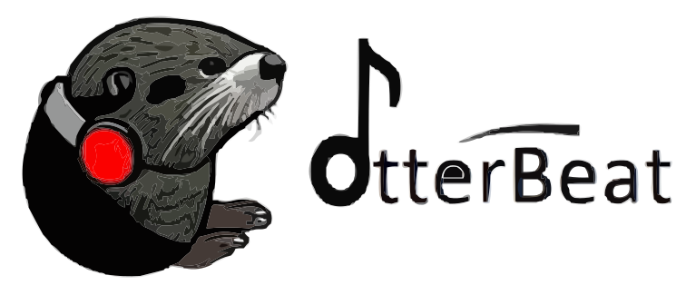

# 3 Weeks of Music Challenge | InterBit Platform

<br />
<p align="center">
  <a href="#">
    
  </a>

  <strong>
    <h3 align="center" >OtterBeat</h3>
  </strong>
  <p align="center">
    <strong>
      Full Stack InterBit Bootcamp Challenge
    </strong>
    <br />
    <a href="#"><strong>View Demo Website »</strong></a>
    <br />
  </p>
</p>


## 🛠 Description - About the App
> “*When you're happy you enjoy the beat, but when you're sad you understand the words . . . *”.

A web-based platform, built as a mobile and desktop website 


### Built With
**Client:**
-   [x] React Hooks
-   [x] Vite
-   [x] Written in TypeScript ♥
-   [x] MUI
-   [x] Using Eslint & Prettier for text edittor.

**Server:**
-   [x] Node - TypeScript
-   [x] Express
-   [x] PostgreSQL
-   [x] Redis caching server
-   [x] Unit tests
-   [x] Docker

### Run by 

# Clone the repository
```bash
  git clone https://github.com/shani24levi/OtterBeat.git
```
# Navigate to the code repository & install packages needed to run backend 
```bash
  cd back-end
```
```bash
  npm install
```
# In a new tab open redis connection
```bash
  redis-server
```
```bash
  npm run dev
```

# Navigate to the code repository & install packages needed to run backend:
```bash
  cd front-end
```
```bash
  npm install
```
```bash
  npm run dev
```


### Web System


