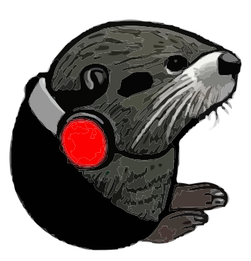

# 3 Weeks of Music Challenge | InterBit Platform

 

  

  <strong>
    <h3 align="center" >OtterBeat</h3>
  </strong>
  

    <strong>
      Full Stack InterBit Bootcamp Challenge
    </strong>
     
    <a href="#"><strong>View Demo Website »</strong></a>
     
  

## 🛠 Description - About the App
> “*When you're happy you enjoy the beat, but when you're sad you understand the words . . . *”.

A web-based platform, built as a mobile and desktop website

### Built With
**Client:**
-   [x] React Hooks
-   [x] Vite
-   [x] Written in TypeScript ♥
-   [x] MUI
-   [x] Using Eslint & Prettier for text edittor.

**Server:**
-   [x] Node - TypeScript
-   [x] Express
-   [x] PostgreSQL
-   [x] Redis caching server
-   [x] Unit tests
-   [x] Docker

